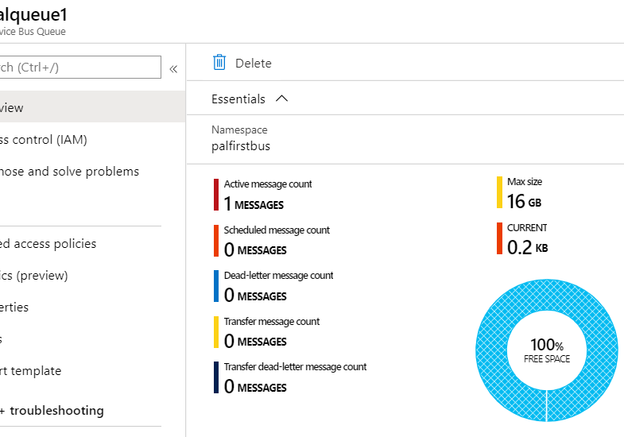
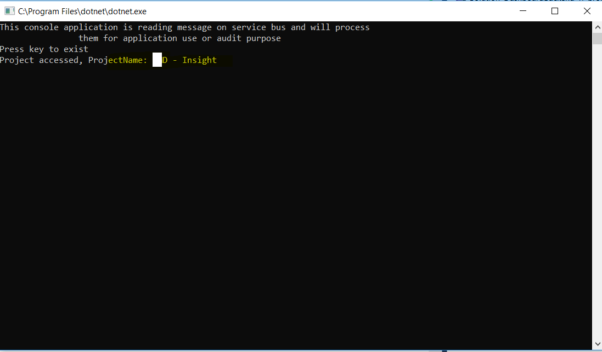

# **Asp.Net Core Web API with GraphQL endpoint and AzureServiceBus Queue communication**

## Technology stack

- Asp.net core web api (.net core version 2.2)
- GraphQL API endpoint
- Entity framework core
- SQL Server database
- azure service bus - queue

## POC features
- API written with proper architecture
- GraphQL endpoint is created
- When project data accessed with perticular project id, message is pushed in azure service bus queue 
- separate service bus message consumer console application is written who is right now reading messages and writing them on console

## GraphQL Get queries examples working with this app
######Below query returns all the projects with projectid, projectname and persons allocated to project list which has personid and personname information with each person.
```{
  projects {
    projectId,
    projectName,
    persons {
      personId,
      personName
    }  } }```

Sample Response

```
{
  "data": {
    "projects": [
      {
        "projectId": 1,
        "projectName": "MyWork - Insight",
        "persons": [
          {
            "personId": 1478,
            "personName": "Amit Gupta Manager"
          },
          {
            "personId": 1481,
            "personName": "Amit Nirmal Architect"
          }
        ]
      },
      {
        "projectId": 2,
        "projectName": "DDR - Best Data",
        "persons": []
      },
      {
        "projectId": 3,
        "projectName": "TMP - RMO",
        "persons": []
      },
      { ...
	  ```

######Below query returns project with id 1 with projectid, projectname and persons allocated to project list which has personid and personname information with each person and person who has role 5 (manager role).
```{
  project(projectid:1) {
    projectId,
    projectName,
    persons(roleid:5){
      personId,
      personName
    }
  }
}
```
Sample Response
```
{
  "data": {
    "project": {
      "projectId": 1,
      "projectName": "MyWork - Insight",
      "persons": [
        {
          "personId": 1478,
          "personName": "Amit Gupta Manager"
        }
      ]
    }
  }
}
```
###Screenshots

####Message at azure service bus


####Service bus- queue - Receiver console application - receiving message from queue



